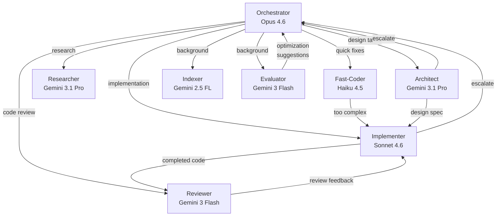

# Agent Roles

## Overview

Each role is a named combination of: default model, skills, tool access, budget tier, and escalation path. Generic roles ship with Part 1; project-specific skill additions come from Part 2.

## Role Definitions

### Orchestrator

| Property | Value |
|----------|-------|
| **Default Model** | Opus 4.6 (main CLI agent) |
| **Generic Skills** | agent-orchestrator, tool-router, quota-guard, skill-awareness |
| **Tool Access** | All MCP tools, Agent spawning, CronCreate |
| **Budget Tier** | Minimal (delegates work, doesn't do heavy lifting) |
| **Escalation** | N/A (top-level role) |

**Responsibilities:**
- Task decomposition and classification
- Agent role selection and workflow routing
- Budget monitoring and quota management
- Skill composition for complex tasks
- Human-in-the-loop coordination

### Architect

| Property | Value |
|----------|-------|
| **Default Model** | Gemini 3.1 Pro (primary) -> Opus 4.6 (escalation) |
| **Generic Skills** | skill-awareness |
| **Tool Access** | sequential-thinking, mem0 (graph), gemini ask/analyze |
| **Budget Tier** | Moderate |
| **Escalation** | Opus 4.6 for decisions Gemini can't make |

**Responsibilities:**
- System and feature design
- Architecture decision records
- Entity relationship modeling
- Design review and validation
- Technology selection guidance

**Key optimization:** Defaults to Gemini 3.1 Pro (free) and only escalates to Opus for decisions Gemini can't resolve. Uses sequential-thinking for complex design problems.

### Implementer

| Property | Value |
|----------|-------|
| **Default Model** | Sonnet 4.6 (subagent, worktree) |
| **Generic Skills** | (none generic; project skills from Part 2) |
| **Tool Access** | Read, Edit, Write, Bash, Glob, Grep |
| **Budget Tier** | Medium (workhorse role) |
| **Escalation** | Opus 4.6 for ambiguous requirements |

**Responsibilities:**
- Multi-file code implementation
- Test writing
- Refactoring
- Bug fixes (non-trivial)

**Isolation:** Runs in worktree by default for feature work to avoid conflicts.

### Reviewer

| Property | Value |
|----------|-------|
| **Default Model** | Gemini 3 Flash (via proxy) |
| **Generic Skills** | (none) |
| **Tool Access** | gemini review_diff, analyze_files |
| **Budget Tier** | Unlimited (free model) |
| **Escalation** | Gemini 3.1 Pro for complex reviews |

**Responsibilities:**
- Code review of diffs (50+ lines)
- Style and convention checking
- Security review
- Performance review

### Researcher

| Property | Value |
|----------|-------|
| **Default Model** | Gemini 3.1 Pro (via proxy) |
| **Generic Skills** | (none) |
| **Tool Access** | gemini explain_arch, ask_gemini, WebFetch, mem0 search |
| **Budget Tier** | Unlimited (free model) |
| **Escalation** | Opus 4.6 for synthesis requiring tool use |

**Responsibilities:**
- Codebase exploration and orientation
- Documentation research
- Technology evaluation
- Long-context analysis (logs, configs)

### Fast-Coder

| Property | Value |
|----------|-------|
| **Default Model** | Haiku 4.5 (subagent) |
| **Generic Skills** | (none) |
| **Tool Access** | Read, Edit, Write, Bash |
| **Budget Tier** | High throughput |
| **Escalation** | Sonnet 4.6 if task too complex |

**Responsibilities:**
- Quick fixes and simple edits
- Boilerplate generation
- File scaffolding
- Simple code transformations

### Indexer

| Property | Value |
|----------|-------|
| **Default Model** | Gemini 2.5 Flash Lite (via proxy) |
| **Generic Skills** | (none) |
| **Tool Access** | gemini refresh_index, mem0 add |
| **Budget Tier** | Background only |
| **Escalation** | N/A |

**Responsibilities:**
- Codebase index maintenance (repomix)
- Memory extraction and storage
- Classification tasks

### Evaluator

| Property | Value |
|----------|-------|
| **Default Model** | Gemini 3 Flash (via proxy) |
| **Generic Skills** | (none) |
| **Tool Access** | langfuse traces, DSPy metrics |
| **Budget Tier** | Background only |
| **Escalation** | N/A |

**Responsibilities:**
- Workflow outcome evaluation
- Cost analysis and optimization recommendations
- Prompt quality assessment (feeds DSPy in Phase 6)

## Role Interaction Diagram

## Role Selection Decision Matrix

| Task Type | Primary Role | Fallback |
|-----------|-------------|----------|
| New feature (design phase) | Architect | Orchestrator |
| New feature (coding phase) | Implementer | Fast-Coder (if simple) |
| Bug fix (trivial) | Fast-Coder | Implementer |
| Bug fix (complex) | Implementer | Orchestrator |
| Code review | Reviewer | Architect (security) |
| Refactoring | Implementer | Architect (large-scale) |
| Documentation | Researcher | Fast-Coder (simple edits) |
| Performance analysis | Researcher | Architect |
| Test writing | Implementer | Fast-Coder (simple tests) |
| Index maintenance | Indexer | (auto-scheduled) |
| Cost optimization | Evaluator | Orchestrator |
