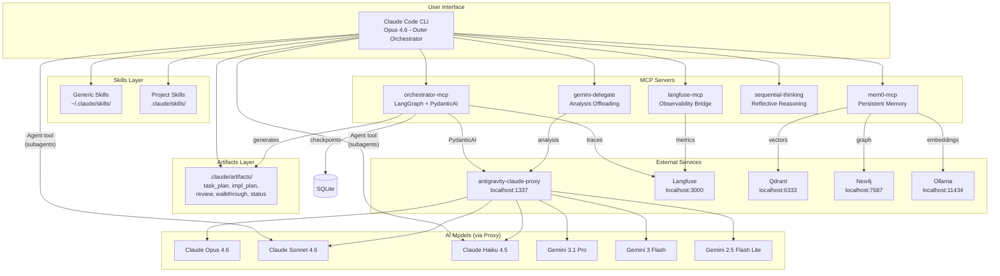
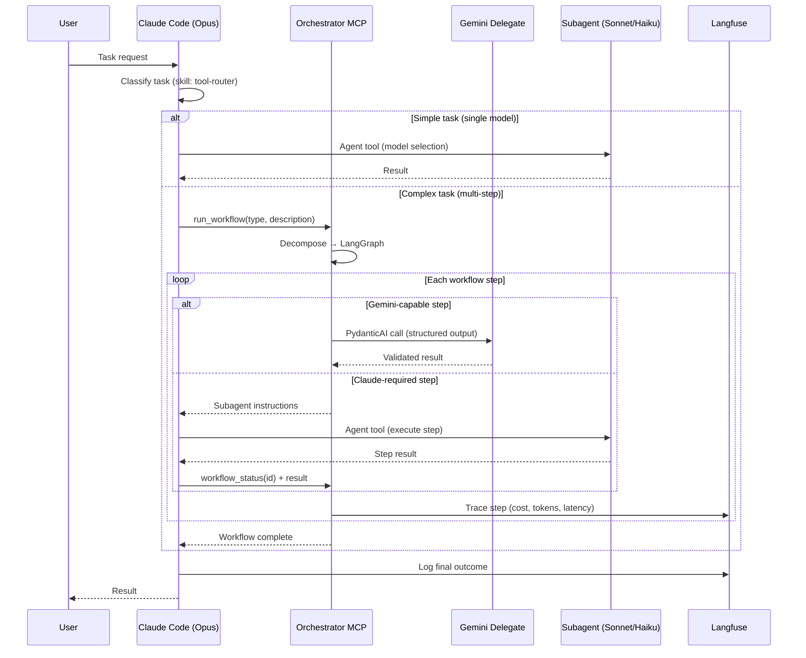
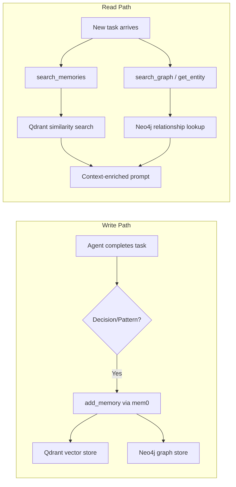
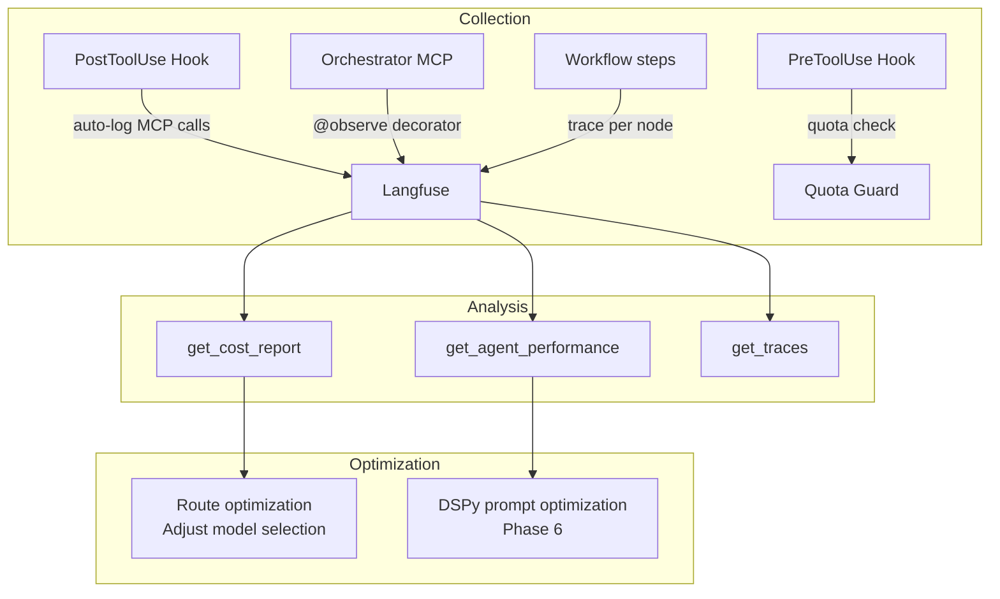
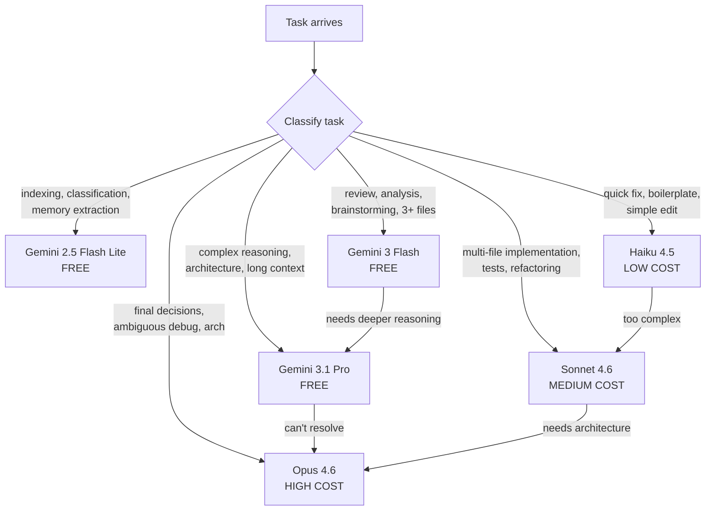

# Architecture Overview

## System Context

The Multi-Agent Orchestration System coordinates multiple AI models and tools through Claude Code CLI as the outer orchestrator. It provides reusable infrastructure (Part 1) that any project can customize (Part 2).

## Data Flow

### Request Routing Flow

### Memory Flow

### Observability Flow

## Model Selection Flowchart

## Component Interactions

| Component | Depends On | Provides To |
|-----------|-----------|-------------|
| orchestrator-mcp | proxy, langfuse, sqlite | Claude Code (workflow management) |
| gemini-delegate | proxy, .gemini-index | Claude Code (analysis offloading) |
| mem0-mcp | qdrant, neo4j, ollama, proxy | All agents (persistent memory) |
| langfuse-mcp | langfuse server | Claude Code (observability) |
| sequential-thinking | (self-contained) | Architect, Orchestrator roles |
| Hooks | langfuse-mcp, orchestrator-mcp | Auto-logging, quota guardrails, artifact generation |
| Skills | (markdown files) | Claude Code (behavioral guidance) |
| Artifacts | orchestrator-mcp, hooks, skills | User (reviewable deliverables: plans, reviews, status) |

## Key Design Decisions

1. **Claude Code as outer orchestrator** — Not replaced; enhanced with skills, hooks, and MCP tools
2. **Gemini-first cost strategy** — Free models handle everything they can; Claude reserved for what requires it
3. **Hybrid execution** — Gemini calls happen inside orchestrator-mcp (PydanticAI); Claude calls return instructions for Agent tool
4. **SQLite checkpointing** — LangGraph state persists across interruptions; no external DB needed
5. **Structured outputs** — PydanticAI validates all agent responses against schemas; retries on failure
6. **4-layer rate limiting** — Proxy, orchestrator, cron, and per-workflow budget caps
7. **Artifact-driven transparency** — Workflows generate structured markdown deliverables at phase transitions; users review via inline feedback, not raw logs
