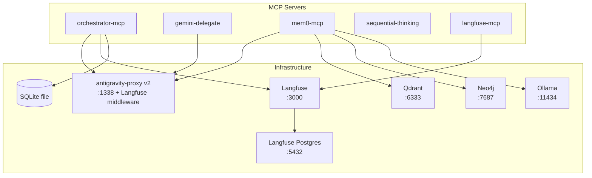

# MCP Servers Reference

## Server Inventory

| Server | Status | Location | Purpose |
|--------|--------|----------|---------|
| gemini-delegate | EXISTING | ~/projects/ai-infra/gemini-delegate/ | Analysis offloading to Gemini |
| mem0-mcp | EXISTING | ~/projects/ai-infra/mem0-mcp/ | Persistent vector + graph memory |
| orchestrator-mcp | NEW | ~/projects/ai-infra/orchestrator-mcp/ | LangGraph workflow engine |
| langfuse-mcp | NEW | ~/projects/ai-infra/langfuse-mcp/ | Observability bridge |
| sequential-thinking | NEW | npx @modelcontextprotocol/server-sequential-thinking | Reflective reasoning |

## Server Dependency Diagram



---

## gemini-delegate (EXISTING)

**Entry point:** `gemini_delegate.server:main`
**Run:** `uv run --directory ~/projects/ai-infra/gemini-delegate gemini-delegate`

### Tools

#### `analyze_files(file_paths: list[str], question: str) -> str`
Bulk code comprehension. Reads multiple files and answers a question about them using Gemini.
- **Use when:** Need to understand 3+ files
- **Model:** GEMINI_PRO_MODEL (default: gemini-3-flash)
- **Example:** `analyze_files(["src/api.py", "src/models.py", "src/db.py"], "How does the API handle authentication?")`

#### `review_diff(diff: str = "", base_branch: str = "main", paths: list[str] = []) -> str`
Code review of diffs. Accepts raw diff text or generates from git.
- **Use when:** Diff is 50+ lines
- **Model:** GEMINI_PRO_MODEL
- **Example:** `review_diff(base_branch="main", paths=["src/"])`

#### `explain_architecture(directory: str = ".") -> str`
Project orientation with codebase structure analysis.
- **Use when:** Starting a session or asking "how does X work" broadly
- **Model:** GEMINI_PRO_MODEL
- **Example:** `explain_architecture("src/domain")`

#### `refresh_index(directory: str = ".", compress: bool = True, include: str = "") -> str`
Rebuild .gemini-index using repomix with tree-sitter compression.
- **Use when:** After significant code changes
- **Model:** N/A (local tool, no LLM call)
- **Example:** `refresh_index(compress=True)`

#### `ask_gemini(question: str, context: str = "") -> str`
General questions with large context. No tool use needed.
- **Use when:** Summaries, explanations, brainstorming, large log analysis
- **Model:** GEMINI_PRO_MODEL
- **Example:** `ask_gemini("Compare these two approaches", context="<large text>")`

### Configuration
```json
{
  "gemini": {
    "command": "uv",
    "args": ["run", "--directory", "~/projects/ai-infra/gemini-delegate", "gemini-delegate"],
    "env": {
      "PROJECT_ROOT": "<project-root>",
      "ANTHROPIC_BASE_URL": "http://localhost:1338",
      "ANTHROPIC_API_KEY": "dummy-key",
      "GEMINI_PRO_MODEL": "gemini-3-flash",
      "GEMINI_FLASH_MODEL": "gemini-2.5-flash-lite"
    }
  }
}
```

---

## mem0-mcp (EXISTING)

**Entry point:** `mem0_mcp.server:main`
**Run:** `uv run --directory ~/projects/ai-infra/mem0-mcp mem0-mcp`

### Tools

#### `add_memory(text: str) -> str`
Store a fact, decision, or pattern. Auto-scoped by user_id and agent_id (MEM0_APP_ID).
- **Example:** `add_memory("Project uses DDD with three layers: Core, CoreApp, CoreData")`

#### `search_memories(query: str) -> str`
Semantic vector search across stored memories.
- **Example:** `search_memories("authentication architecture")`

#### `list_memories() -> str`
List all memories for current user/app scope.

#### `delete_memory(memory_id: str) -> str`
Remove a specific memory by UUID.

#### `search_graph(query: str) -> str` *(requires MEM0_ENABLE_GRAPH=true)*
Neo4j entity relationship search. Finds connected entities.
- **Example:** `search_graph("What entities relate to Contract?")`

#### `get_entity(name: str) -> str` *(requires MEM0_ENABLE_GRAPH=true)*
Get all relationships for a named entity from the knowledge graph.
- **Example:** `get_entity("Remittance")`

### Configuration
```json
{
  "mem0": {
    "command": "uv",
    "args": ["run", "--directory", "~/projects/ai-infra/mem0-mcp", "mem0-mcp"],
    "env": {
      "MEM0_APP_ID": "{{PROJECT_ID}}",
      "ANTHROPIC_BASE_URL": "http://localhost:1338",
      "ANTHROPIC_API_KEY": "dummy-key",
      "MEM0_ENABLE_GRAPH": "true"
    }
  }
}
```

---

## orchestrator-mcp (NEW)

**Entry point:** `orchestrator_mcp.server:main`
**Run:** `uv run --directory ~/projects/ai-infra/orchestrator-mcp orchestrator-mcp`

### Tools

#### `run_workflow(type: str, description: str, files: list[str] = [], options: dict = {}) -> dict`
Launch a stateful multi-step workflow. Generates artifacts at phase transitions (task plans, implementation plans, review results) to `.claude/artifacts/`.
- **type:** "feature", "review", "refactor", "sprint"
- **Returns:** `{ workflow_id, status, current_step, next_action }`
- **Artifacts:** Triggers `update-workflow-artifact.py` PostToolUse hook → `workflow_status.md`
- **Example:** `run_workflow("feature", "Add user authentication", files=["src/auth/"])`

#### `workflow_status(workflow_id: str) -> dict`
Get progress of a running workflow. Updates `workflow_status.md` artifact via PostToolUse hook.
- **Returns:** `{ workflow_id, status, completed_steps, current_step, next_action, cost_so_far }`

#### `list_workflows(status_filter: str = "all") -> list[dict]`
List workflows by status: "active", "completed", "cancelled", "all".

#### `cancel_workflow(workflow_id: str, reason: str = "") -> dict`
Cancel a running workflow with reason.

#### `get_quota_state() -> dict`
Poll proxy health and account limits.
- **Returns:** `{ models: { <model>: { available, rpm_remaining, tpm_remaining } }, recommendation }`

#### `get_quota_report() -> dict`
Velocity-based quota report combining proxy data and session throttle state.
- **Returns:** `{ velocity, model_limits, session_budget, risk }`
- **Sources:** Proxy `/velocity` endpoint, `/health` endpoint, session state file

#### `optimize_prompts(role: str, examples_count: int = 10) -> dict`
DSPy prompt optimization for a role using workflow history. (Phase 6)

### Configuration
```json
{
  "orchestrator": {
    "command": "uv",
    "args": ["run", "--directory", "~/projects/ai-infra/orchestrator-mcp", "orchestrator-mcp"],
    "env": {
      "ANTHROPIC_BASE_URL": "http://localhost:1338",
      "ANTHROPIC_API_KEY": "dummy-key",
      "LANGFUSE_HOST": "http://localhost:3000",
      "LANGFUSE_PUBLIC_KEY": "<from-langfuse-ui>",
      "LANGFUSE_SECRET_KEY": "<from-langfuse-ui>"
    }
  }
}
```

---

## langfuse-mcp (NEW)

**Entry point:** `langfuse_mcp.server:main`
**Run:** `uv run --directory ~/projects/ai-infra/langfuse-mcp langfuse-mcp`

### Tools (Pure Analytics — Read-Only)

#### `get_cost_report(period: str = "24h", group_by: str = "source") -> dict`
Aggregated cost and activity breakdown from Langfuse traces. Real data from all 3 sources.
- **group_by:** "source", "model", "agent"
- **Returns:** `{ total_traces, total_cost_usd, breakdown, model_tokens }`

#### `get_agent_performance(agent_id: str, period: str = "24h") -> dict`
Performance metrics for an agent role: action breakdown, models used, avg latency.

#### `get_traces(trace_id: str) -> dict`
Full trace details with all observations (generations/spans), token counts, and costs.

#### `get_session_summary(session_id: str = "") -> dict`
Session-level summary combining traces from all 3 sources (hooks, proxy, OTEL).
- Auto-reads `~/.claude-session-id` if no session_id provided
- **Returns:** `{ total_traces, sources, top_tools, models, timeline }`

### Configuration
```json
{
  "langfuse": {
    "command": "uv",
    "args": ["run", "--directory", "~/projects/ai-infra/langfuse-mcp", "langfuse-mcp"],
    "env": {
      "LANGFUSE_HOST": "http://localhost:3000",
      "LANGFUSE_PUBLIC_KEY": "<from-langfuse-ui>",
      "LANGFUSE_SECRET_KEY": "<from-langfuse-ui>"
    }
  }
}
```

---

## sequential-thinking (NEW)

**Run:** `npx @modelcontextprotocol/server-sequential-thinking`
**Type:** stdio MCP server (Node.js)

### Tools

#### `create_thinking_session(problem: str) -> str`
Start a sequential thinking session for complex problem decomposition.

#### `add_thought(session_id: str, thought: str, confidence: float) -> str`
Add a thought to an active session with confidence score.

#### `revise_thought(session_id: str, thought_index: int, revised: str) -> str`
Revise a previous thought in the sequence.

#### `get_conclusion(session_id: str) -> str`
Get the synthesized conclusion from the thought sequence.

### Configuration
```json
{
  "sequential-thinking": {
    "command": "npx",
    "args": ["-y", "@modelcontextprotocol/server-sequential-thinking"]
  }
}
```
