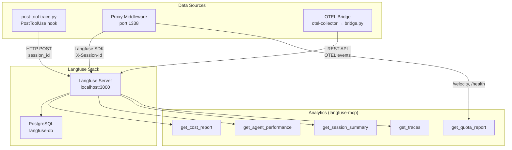

# Observability & Quota Management

## Overview

Observability is built on Langfuse (self-hosted at http://localhost:3000) with three data sources feeding into a single session-linked view:

1. **PostToolUse hook** (`post-tool-trace.py`) — traces every Claude Code tool call
2. **Proxy middleware** (port 1338) — traces all Gemini API calls with token counts and cost
3. **OTEL bridge** — captures Claude API calls via OpenTelemetry telemetry

All three sources share `session_id` for cross-source correlation in Langfuse.

## Architecture



## Hook Architecture (Consolidated)

Two hooks replace the previous 12:

### pre-tool-gate.py (PreToolUse, matcher: `.*`)

Single entry point for all PreToolUse enforcement. Internally dispatches:

| Gate | Applies To | Behavior |
|------|-----------|----------|
| Session gate | All tools | Blocks until `init_session` writes breadcrumb |
| Pending actions | All tools | Non-blocking 10-min reminders for pending memory/stale docs |
| Throttle | Agent | Budget enforcement per model tier |
| Model gate | Agent | Cheapest-capable-first model selection |
| Task gate | Agent | One-time nudge for task tracking after 5+ agents |
| Gemini delegation | Read | Suggests `analyze_files` after 5+ unique file reads |

Also writes `session_id` to `~/.claude-session-id` for MCP server trace correlation.

### post-tool-trace.py (PostToolUse, matcher: `.*`)

Single entry point for all PostToolUse side effects. Internally dispatches:

| Handler | Applies To | Side Effect |
|---------|-----------|-------------|
| Langfuse trace | All tools (except ToolSearch) | Trace + optional generation span to Langfuse |
| Throttle tracker | Agent | Increments model tier counters |
| Task artifact | Task* | Updates `.tasks-state.json` and renders `tasks.md` |
| Workflow artifact | orchestrator workflow | Renders `workflow_status.md` |
| Memory save | orchestrator workflow | Queues completed workflow outcomes for mem0 |
| Doc tracker | Edit, Write | Flags related docs as potentially stale |

### State Files

| File | Scope | Contents |
|------|-------|----------|
| `.session-state.json` | Daily reset | Session validation, throttle counters, read tracker, cooldowns |
| `.persistent-state.json` | Cross-day | Doc staleness, pending memory queue |
| `.tasks-state.json` | Per-session | Task list with dependencies and status |

Shared library at `.claude/hooks/lib/`:
- `state.py` — State file I/O with daily reset and legacy migration
- `langfuse.py` — Langfuse REST API tracing (auth, classify, send)
- `decisions.py` — Hook decision formatting (deny, allow, message)

## Proxy Tracing (port 1338)

The forked antigravity proxy at `ai-infra/proxy/` includes Langfuse middleware:

- Intercepts all `POST /v1/messages` calls
- Reads `X-Session-Id` and `X-Caller` headers from MCP servers
- Creates Langfuse trace with generation span including token counts
- Scores trace with estimated cost from pricing table
- Supports both streaming and non-streaming responses

Langfuse traces named `proxy:{model}` with metadata:
```json
{"model": "gemini-3-flash", "caller": "gemini-delegate", "source": "proxy-middleware", "stream": false}
```

## OTEL Bridge

Docker services in `ai-infra/docker-compose.yml`:
- **otel-collector** (ports 4317/4318) — receives OTEL from Claude Code
- **otel-bridge** — tails collector JSONL, translates to Langfuse REST API

Enabled via `.envrc`:
```bash
export CLAUDE_CODE_ENABLE_TELEMETRY=1
export OTEL_EXPORTER_OTLP_ENDPOINT="http://localhost:4318"
export OTEL_EXPORTER_OTLP_PROTOCOL="http/protobuf"
```

## Quota Management

### get_quota_report (orchestrator-mcp)

Velocity-based quota report combining:
1. **Call velocity** from proxy `/velocity` endpoint (5min/1hr/24hr)
2. **Model rate limits** from proxy `/health` (remaining %, reset times)
3. **Session budget** from hook state (Agent calls by tier vs profile limits)
4. **Risk assessment** based on velocity trends and cooldown status

### get_session_summary (langfuse-mcp)

Session-level analytics from Langfuse:
- Trace counts by source (hook, proxy, OTEL)
- Top tools used
- Model usage breakdown
- Timeline of activity

### get_cost_report (langfuse-mcp)

Aggregated cost breakdown from all Langfuse traces:
- Group by source, model, or agent
- Real token counts from proxy generations
- Links to Langfuse dashboard

## Langfuse Self-Hosted Setup

### Docker Compose Services

```yaml
langfuse:
  image: langfuse/langfuse:2
  ports: ["3000:3000"]
  depends_on: [langfuse-db]

langfuse-db:
  image: postgres:16

otel-collector:
  image: otel/opentelemetry-collector-contrib:0.112.0
  ports: ["4317:4317", "4318:4318"]

otel-bridge:
  build: ./otel-bridge
  depends_on: [langfuse, otel-collector]
```

### API Keys

Configured in `.mcp.json` for langfuse-mcp and orchestrator-mcp:
- `LANGFUSE_PUBLIC_KEY` / `LANGFUSE_SECRET_KEY`
- Same credentials hardcoded in hook `lib/langfuse.py` (localhost only)

## Trace Naming Convention

| Source | Trace Name | Example |
|--------|-----------|---------|
| Hook: Agent | `{subagent_type}:{description}` | `Explore:Find config files` |
| Hook: MCP | `{server}:{tool}` | `gemini:analyze_files` |
| Hook: Read/Edit | `orchestrator:{tool}` | `orchestrator:read` |
| Hook: Bash | `orchestrator:{description}` | `orchestrator:Check health` |
| Proxy | `proxy:{model}` | `proxy:gemini-3-flash` |
| OTEL | `claude-code:{event}` | `claude-code:api_request` |
