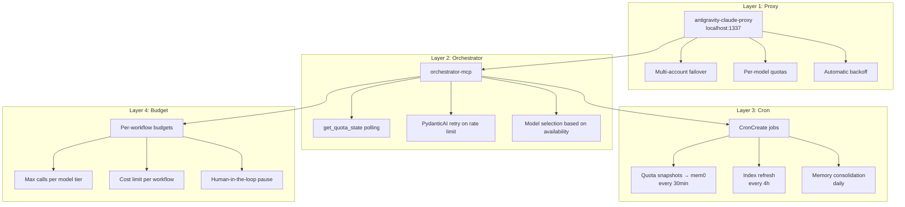
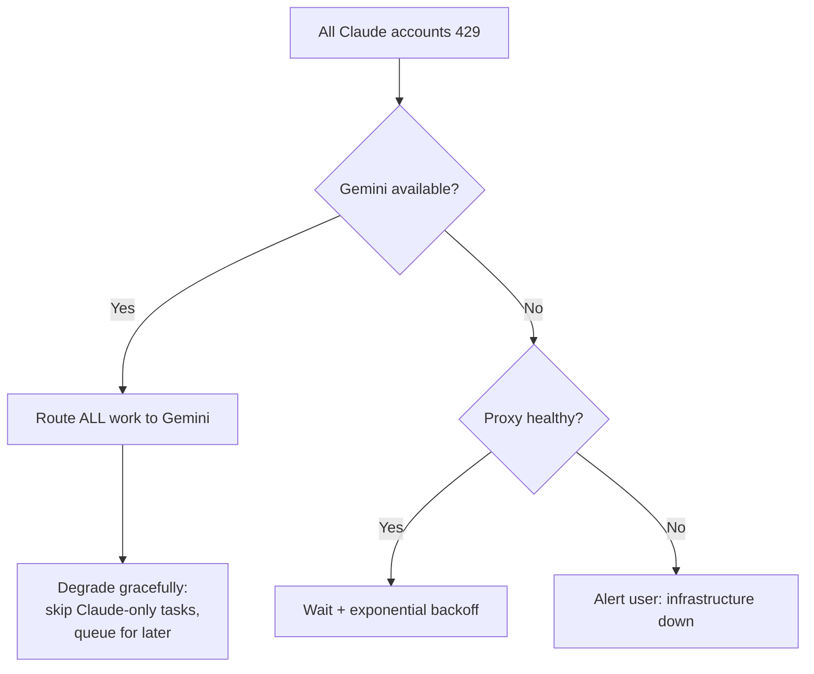

# Rate Limiting & Quota Management

## Overview

Rate limiting operates at 4 layers, from infrastructure to workflow level. The goal is to maximize throughput while respecting API limits and controlling costs.

## 4-Layer Architecture



## Layer 1: Proxy (Existing)

The antigravity-claude-proxy handles:
- **Multi-account failover:** Rotates between API keys when one hits limits
- **Per-model quotas:** Tracks RPM/TPM per model per account
- **Automatic backoff:** Exponential retry with jitter on 429 responses
- **Health endpoint:** `/health` returns current account status and limits

**Known limitation:** Proxy strips `cache_control` fields (no Anthropic prompt caching through Gemini).

## Layer 2: Orchestrator

### get_quota_state

Polls proxy health endpoint and returns actionable recommendations.

```python
# Example response
{
    "models": {
        "claude-opus-4-6": {
            "available": True,
            "rpm_remaining": 45,
            "tpm_remaining": 800000,
            "accounts_active": 2
        },
        "gemini-3-flash": {
            "available": True,
            "rpm_remaining": None,  # unlimited via proxy
            "tpm_remaining": None
        }
    },
    "recommendation": "All models available. Prefer Gemini for cost optimization."
}
```

### PydanticAI Retry Logic

When a model returns 429:
1. PydanticAI catches the rate limit error
2. Retries with exponential backoff (1s, 2s, 4s)
3. After 3 retries, falls back to next model in priority order
4. Logs all retries to Langfuse

### Model Fallback Chain

```
Gemini 2.5 Flash Lite → Gemini 3 Flash → Gemini 3.1 Pro → Haiku → Sonnet → Opus
```

If a Gemini model is unavailable, try next Gemini first (free). Only fall back to Claude if all Gemini models are unavailable.

## Layer 3: Cron Jobs

### Quota Monitoring (every 30 minutes)
```
CronCreate: "quota-snapshot"
Schedule: */30 * * * *
Action: Poll get_quota_state, store in mem0 for trend analysis
Purpose: Track quota usage patterns, predict rate limits
```

### Index Refresh (every 4 hours)
```
CronCreate: "index-refresh"
Schedule: 0 */4 * * *
Action: Call gemini refresh_index
Purpose: Keep codebase index fresh for accurate analysis
```

### Memory Consolidation (daily)
```
CronCreate: "memory-consolidation"
Schedule: 0 2 * * *
Action: List memories, identify duplicates/stale entries, consolidate
Purpose: Prevent memory bloat, improve search relevance
```

### Session-Start Recreation

CronCreate jobs expire after 3 days. The `agent-orchestrator` skill includes instructions to recreate cron jobs at session start:
1. Check if cron jobs exist (CronList)
2. If missing, recreate all three patterns
3. Log recreation to Langfuse

## Layer 4: Per-Workflow Budgets

### Budget Profiles

| Profile | Cost Limit | Max Opus Calls | Max Sonnet Calls | Max Gemini Calls |
|---------|-----------|----------------|------------------|------------------|
| **low** | $0.50 | 0 | 2 | Unlimited |
| **medium** | $2.00 | 2 | 10 | Unlimited |
| **high** | $5.00 | 5 | 25 | Unlimited |
| **unlimited** | No limit | No limit | No limit | Unlimited |

### Default Profile per Workflow

| Workflow Type | Default Budget | Rationale |
|--------------|---------------|-----------|
| review | low | All Gemini, effectively free |
| feature | medium | Mix of Claude + Gemini |
| refactor | medium | Mostly Sonnet implementation |
| sprint | low | All Gemini planning |

### Budget Enforcement

```python
def check_budget(state: WorkflowState) -> str:
    """LangGraph conditional edge."""
    if state["total_cost"] >= state["cost_limit"]:
        # Trigger human-in-the-loop interrupt
        return "pause"
    return "continue"
```

When paused:
1. Workflow state saved to checkpoint
2. `workflow_status` returns `needs_human_input: true`
3. Claude Code surfaces the pause to the user
4. User can: increase budget, switch to cheaper models, or cancel

## Edge Cases

### All Accounts Rate-Limited



### Proxy Down

1. Orchestrator catches connection error on `get_quota_state`
2. Falls back to cached quota state from mem0
3. If no cache, assumes all models available (optimistic)
4. Logs warning to Langfuse
5. If proxy stays down >5min, alerts user

### Cost Spike Detection

Evaluator role (background) monitors:
- Per-hour cost > 2x average → log warning
- Per-workflow cost > budget * 0.8 → pre-emptive warning
- Model usage pattern anomaly → suggest router adjustment

## Cost Optimization Strategies

1. **Gemini-first:** Always try free model before paid
2. **Batch similar tasks:** Group small edits for single Haiku call
3. **Cache-aware:** Don't re-read files already in context
4. **Smart escalation:** Only escalate on actual failure, not predicted complexity
5. **Background indexing:** Keep index fresh to avoid expensive re-analysis
6. **Memory-first:** Check mem0 before re-computing (search_memories before design)
