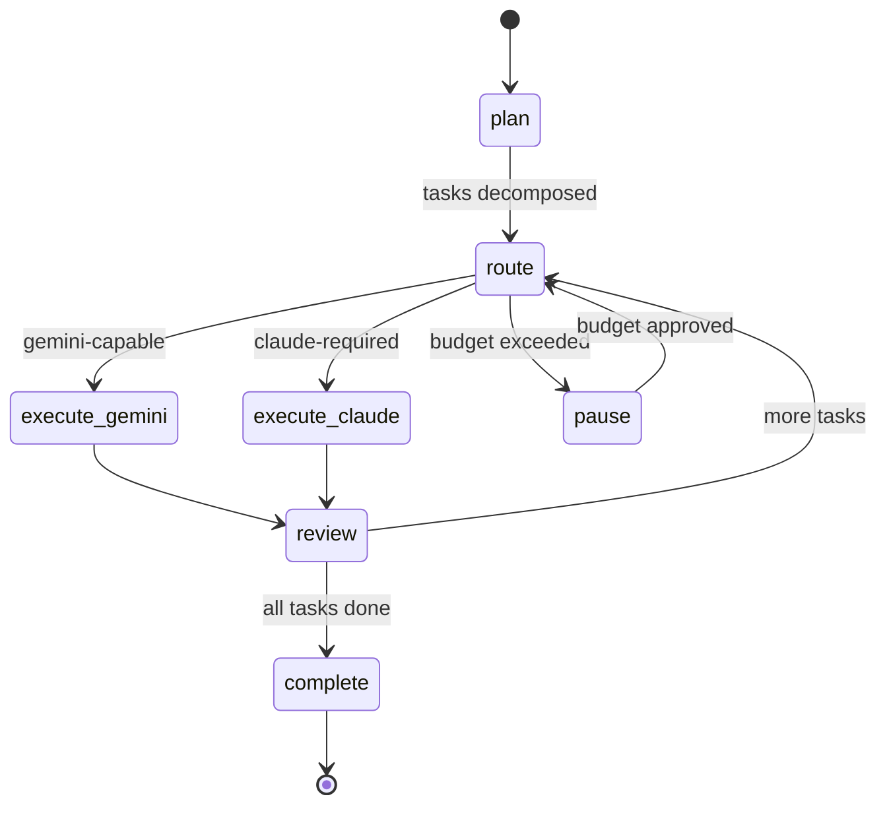
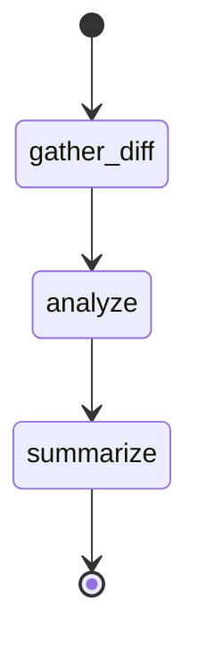
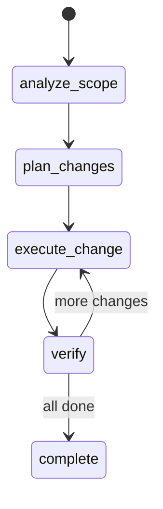
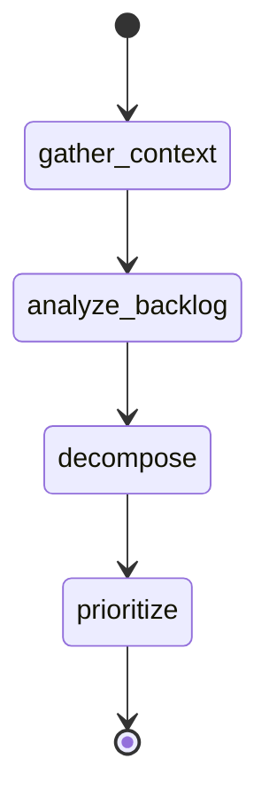
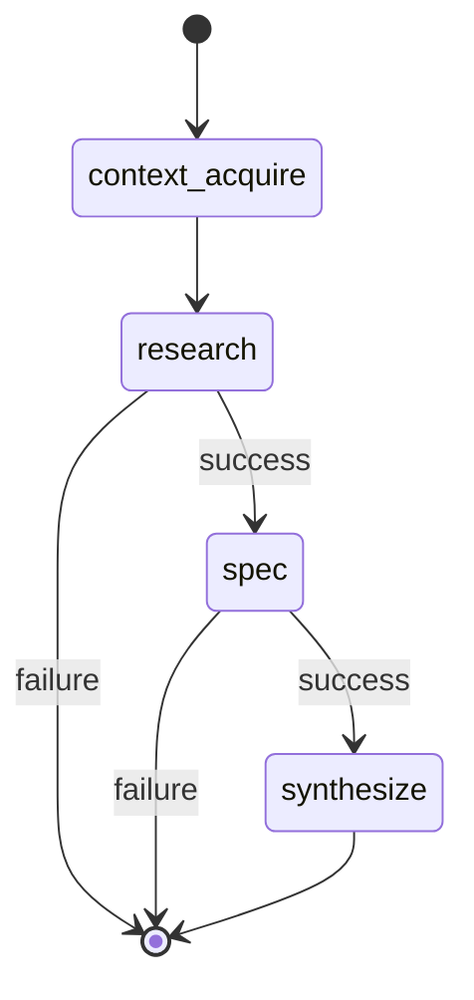

# Workflow Engine Documentation

## Overview

The workflow engine uses LangGraph to manage multi-step tasks as stateful graphs. Each workflow type is a StateGraph with typed state, nodes (agent actions), and edges (routing logic). State is checkpointed to SQLite after every node, enabling pause/resume and human-in-the-loop interrupts.

## WorkflowState Schema

```python
from typing import TypedDict, Annotated, Literal
from langgraph.graph import add_messages

class WorkflowState(TypedDict):
    # Identity
    workflow_id: str
    workflow_type: str
    description: str
    files: list[str]
    options: dict

    # Progress
    status: Literal["planning", "executing", "reviewing", "paused", "completed", "cancelled", "failed"]
    current_step: str
    completed_steps: list[dict]  # [{step, agent, model, result, cost, duration}]

    # Task management
    tasks: list[dict]            # Decomposed tasks from planning phase
    task_index: int              # Current task being executed

    # Agent communication
    messages: Annotated[list, add_messages]  # LangGraph message accumulator
    next_action: dict            # Instructions for Claude Code to execute

    # Budget
    budget_profile: str          # "low", "medium", "high"
    total_cost: float
    cost_limit: float

    # Control
    needs_human_input: bool
    error: str | None
    cancel_reason: str | None
```

### State Reducers

- `messages`: Uses LangGraph's `add_messages` — appends new messages, deduplicates by ID
- `completed_steps`: Append-only list
- All other fields: Last-write-wins

## Workflow Types

### Feature Workflow

Multi-step implementation of a new feature.



**Nodes:**
| Node | Agent Role | Model | Action | Artifact |
|------|-----------|-------|--------|----------|
| `plan` | Architect | Gemini 3.1 Pro | Decompose feature into tasks, define order | `task_plan.md` |
| `route` | Router (logic) | N/A | Classify next task, select model, check budget | — |
| `execute_gemini` | Varies | Gemini 3.x | PydanticAI structured execution | — |
| `execute_claude` | Implementer | Sonnet/Haiku | Return instructions for Agent tool | — |
| `review` | Reviewer | Gemini 3 Flash | Review completed step output | — |
| `pause` | (interrupt) | N/A | Human-in-the-loop budget approval | — |
| `complete` | (terminal) | N/A | Summarize workflow, store in mem0 | `workflow_status.md` |

**Budget profile:** Medium (default cost_limit: $2.00)

### Review Workflow

Code review of changes.



**Nodes:**
| Node | Agent Role | Model | Action | Artifact |
|------|-----------|-------|--------|----------|
| `gather_diff` | (logic) | N/A | Collect diff from git or provided text | — |
| `analyze` | Reviewer | Gemini 3 Flash | Structured review via review_diff | — |
| `summarize` | (logic) | N/A | Format ReviewResult schema | `review_result.md` |

**Budget profile:** Low (all Gemini, effectively free)

### Refactor Workflow

Systematic refactoring with safety checks.



**Nodes:**
| Node | Agent Role | Model | Action | Artifact |
|------|-----------|-------|--------|----------|
| `analyze_scope` | Researcher | Gemini 3.1 Pro | Identify all affected files/patterns | — |
| `plan_changes` | Architect | Gemini 3.1 Pro | Ordered change plan with rollback points | `implementation_plan.md` |
| `execute_change` | Implementer | Sonnet 4.6 | Apply single change (worktree) | — |
| `verify` | Reviewer | Gemini 3 Flash | Verify change correctness, check tests | — |
| `complete` | (terminal) | N/A | Summarize, store patterns in mem0 | `workflow_status.md` |

**Budget profile:** Medium

### Sprint Workflow

Sprint planning and task breakdown.



**Nodes:**
| Node | Agent Role | Model | Action |
|------|-----------|-------|--------|
| `gather_context` | Researcher | Gemini 3.1 Pro | Search mem0 for project state, recent decisions |
| `analyze_backlog` | Architect | Gemini 3.1 Pro | Review requirements/issues |
| `decompose` | Architect | Gemini 3.1 Pro | Break into implementable tasks |
| `prioritize` | (logic + human) | N/A | Priority ordering with human approval |

**Budget profile:** Low (all Gemini)

### SPDD Feature Workflow

Structured research → spec → implementation pipeline with verification gates. Uses SPDD (Spec-Plan-Do-Deliver) methodology with domain skill loading and context acquisition.



**Nodes:**
| Node | Model | Action | Artifact |
|------|-------|--------|----------|
| `context_acquire` | N/A (I/O only) | Load SPDD skills, project docs, domain skills, file contents | — |
| `research` | Gemini 3 Flash | Analyze codebase and task context, produce research report | — |
| `spec` | Gemini 3 Flash | Create phased implementation spec with file changes and verification criteria | `implementation_plan.md` |
| `synthesize` | Gemini 3 Flash | Convert spec into structured execution instructions for Claude Code agents | `task_plan.md`, `workflow_status.md` |

**Verification gates:** Conditional edges after `research` and `spec` — if a node sets `status: "failed"`, the workflow routes to END instead of continuing.

**Context acquisition loads:**
- SPDD skill files (`1-research.md`, `2-spec.md`, `3-implementation.md`)
- Project docs (CLAUDE.md, PSD.md, architecture_flow.md)
- Domain skills from options (e.g., `rfp_gatherer-patterns`)
- Specified file contents (up to 10 files, <20KB each)

**Budget profile:** Medium

---

## Checkpoint and Resume

- **Storage:** SQLite at `orchestrator-mcp/checkpoints.db`
- **Granularity:** After every node completion
- **Resume:** `workflow_status(id)` returns current state; calling `run_workflow` with same ID resumes
- **TTL:** Completed workflows retained 7 days; active workflows indefinite

## Edge Conditions

### Budget Check (all workflows)
```python
def should_pause(state: WorkflowState) -> str:
    if state["total_cost"] >= state["cost_limit"]:
        return "pause"  # Human-in-the-loop interrupt
    return "continue"
```

### Task Router (feature workflow)
```python
def route_task(state: WorkflowState) -> str:
    task = state["tasks"][state["task_index"]]
    if task["can_use_gemini"]:
        return "execute_gemini"
    return "execute_claude"
```

### Review Gate (feature workflow)
```python
def after_review(state: WorkflowState) -> str:
    if state["task_index"] < len(state["tasks"]) - 1:
        return "route"  # More tasks
    return "complete"
```

## Pydantic Output Schemas

### TaskDecomposition
```python
class Task(BaseModel):
    step: int
    description: str
    agent_role: str
    can_use_gemini: bool
    estimated_complexity: Literal["low", "medium", "high"]
    dependencies: list[int]  # step numbers

class TaskDecomposition(BaseModel):
    tasks: list[Task]
    rationale: str
    estimated_total_cost: float
```

### ReviewResult
```python
class ReviewFinding(BaseModel):
    severity: Literal["critical", "warning", "info"]
    file: str
    line: int | None
    description: str
    suggestion: str

class ReviewResult(BaseModel):
    summary: str
    findings: list[ReviewFinding]
    approved: bool
    confidence: float
```

### ImplementationPlan
```python
class FileChange(BaseModel):
    file_path: str
    action: Literal["create", "modify", "delete"]
    description: str

class ImplementationPlan(BaseModel):
    approach: str
    file_changes: list[FileChange]
    test_strategy: str
    risks: list[str]
```
